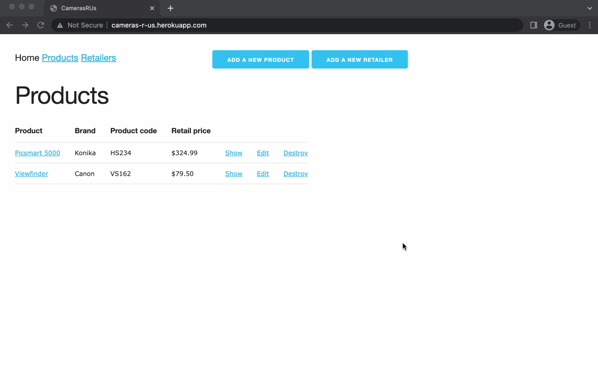

# Cameras R Us

This app has been deployed on Fly.io at [https://cameras-r-us.fly.dev](https://cameras-r-us.fly.dev/).

## Table of Contents

* [Prototype Requirements](#PrototypeRequirements)
* [User Flow & Features](#UserFlowFeatures)
* [Tech Stack](#TechStack)
* [Entity Relationship Diagram](#EntityRelationshipDiagram)
* [Future Improvements / Features](#FutureImprovementsFeatures)
* [Running this app locally](#Runningthisapplocally)

## Prototype Requirements

Create a Rails application that displays product information for product offerings. Specifications:

- Provide a form for adding of retailers (which can later be selected when creating / editing a product)
	- When a new retailer is added, a QR code is created that contains information about the retailer’s location
- Provide a form that allows the creation and editing of a product 
	- This includes a method to select which retailers offer this product for sale
- Each product should have its own web page, which will contain: 
	- basic product information such as brand name, product name, product code and retail price
	- a list of retailers’ locations where the product (camera) can be purchased 
		- each retailer location will have a QR code that can be scanned to populate the location information on the user's mobile device

## User Flow & Features



An example user flow is demonstrated in the gif above. Key features of the app include:

- Google Places autocomplete is implemented on the Retailer Address Field
	- the user must select an address from the dropdown options - validation is in place to not accept manually entered addresses
- A QR Code with the google maps url for the retailer location is generated when a new retailer is created OR when the address of a retailer is updated

## Tech Stack

- **Rails version 6.1.6 & Ruby version 2.7.5**
	- Stable and well-documented
- **RSpec**
	- Industry-standard testing for Rails applications
	- As this is a simple application minimal testing has been implemented, however all tests are currently passing
- **[Google Places Autocomplete](https://developers.google.com/maps/documentation/javascript/places-autocomplete)**
	- The Autocomplete functionality within the Places library of the Google Maps JavaScript API provides type-ahead-search behaviour for "places" - including but not limited to addresses
	- This was implemented in this application as a way to ensure valid user input for retailer addresses, while providing a smooth and familiar user experience
- **[Stimulus.js](https://github.com/hotwired/stimulus)**
	- Thin JS library designed for adding interactivity to the front end, when a full framework such as ReactJS isn't necessary
	- This simplified implementation of Google Places Autocomplete for handling address input
	- Made by Basecamp, supports "the Rails way"
- **[`rqrcode` gem](https://github.com/whomwah/rqrcode)**
	- A ruby gem for creating and rendering QR codes
	- Although QR Codes can be rendered dynamically onto the page, storing them as an image makes for cleaner code and is more efficient, as the same images are rendered on multiple pages
- **AWS S3 storage**
	- Used for storage of QR Codes in production (local storage used in development)
- **[Skeleton CSS](http://getskeleton.com/)**
	- Lightweight CSS boilerplate
	- Used to add basic styling with minimal time investment


## Entity Relationship Diagram

The two models in this application are `retailers` and `products`. The ERD below provides an overview of model associations.


## Future Improvements / Features

- QR Code generation is currently executed in the `retailer.rb` model file. This logic could be moved into a concern, allowing QR Code generation to be accessible for other purposes within the app.
- Currently, two database calls are needed when saving a retailer listing - the initial save, then adding the qr code as per the following line of code (in the retailer model): `after_save :generate_qr, if: :saved_change_to_maps_url?`. It would be ideal to reconfigure this to only require one database call.
- Additional test coverage. The current test suite is minimal.
- Allow users to manually enter an address if it doesn't exist in Google Maps
- Add functionality to create a new retailer within the new product form.

## Running this app locally

The following are requirements in order to run this app locally:
- Ruby version 2.7.5
- Rails version 6.1.6
- PostgreSQL
- Google API Key, with access to the `Google Maps` and `Google Places` APIs
	- the API key should be added to the `credentials.yml` by running the command `rails credentials:edit`, and adding the credentials in the following format:

		```yml
		google:
			maps: <your key here>
		```

Once the above have been installed / set up:
1. clone this repo to your machine
2. `cd` into the application folder
3. `bundle install`
4. `rails db:create`
5. `rails db:migrate`
6. `rails s` to start the rails server
