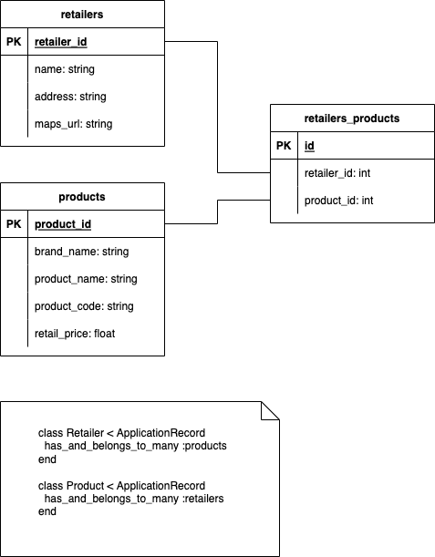

# Cameras R Us

This app has been deployed on Heroku at [https://cameras-r-us.herokuapp.com/](https://cameras-r-us.herokuapp.com/).

## How to run locally
### Requirements

* Ruby version 2.7.5
* Rails version 6.1.6
* PostgreSQL
* Google API Key

## Tech Stack

* Rails version 6.1.6
* Stimulus.js
* RSpec
* AWS S3 storage
* `rqrcode` gem

## Entity Relationship Diagram

